<p align="center">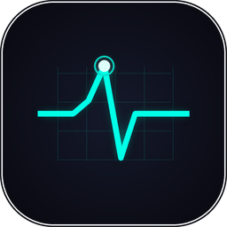</p>
<h1 align="center">OpTask</h1>
<p align="center"><b>The task manager that shows what actually costs you.</b></p>
<p align="center">Task Manager & PC Optimizer · Windows 10/11 · x64 · ~5 MB · Free for personal use</p>
<p align="center"><a href="https://github.com/tapatchUSA/OpTask/releases/latest"><b>⬇ Download OpTask 1.0.2</b></a> &nbsp;·&nbsp; <a href="https://tapatch.com/tools/optask/">tapatch.com/tools/optask</a></p>

<p align="center">
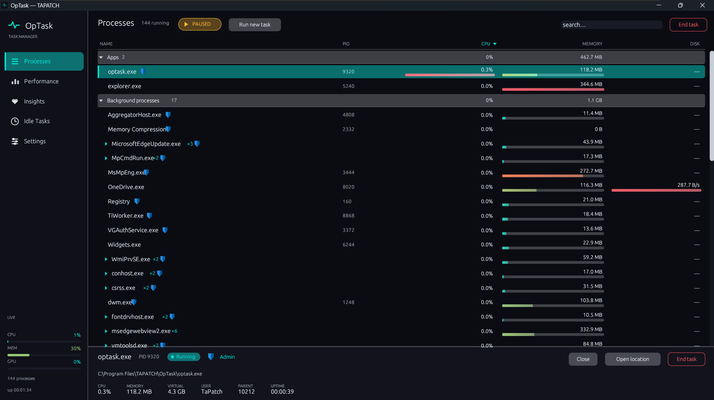<br>
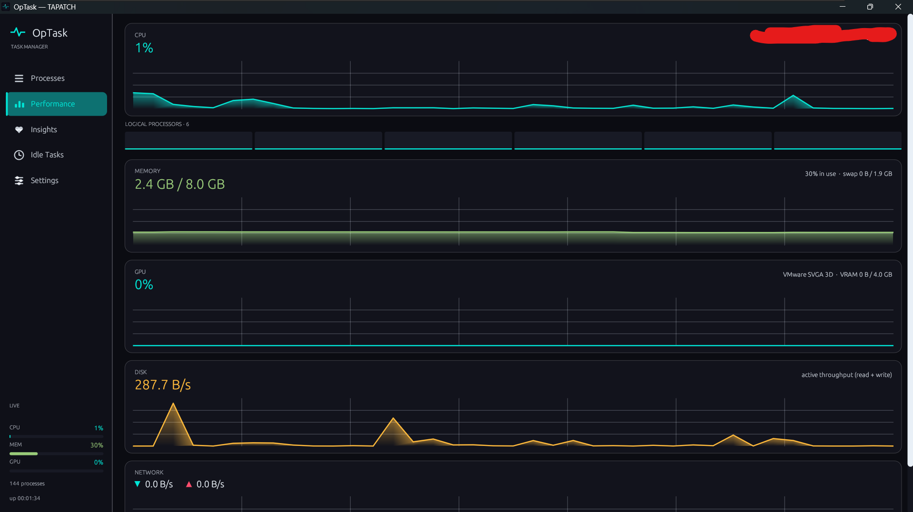 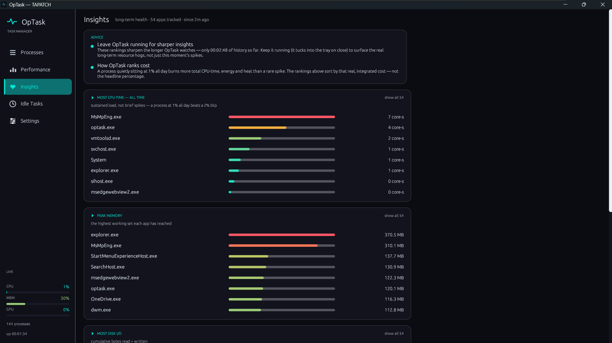<br>
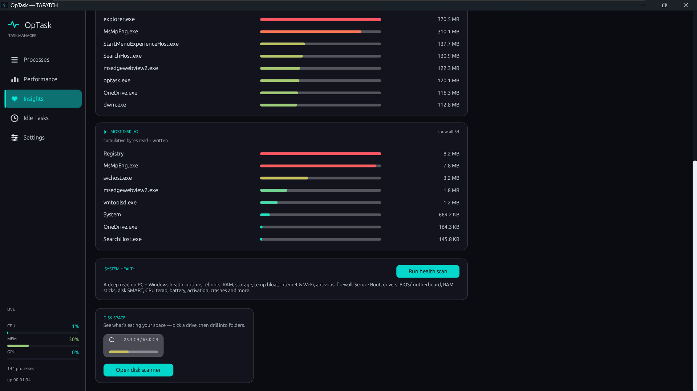 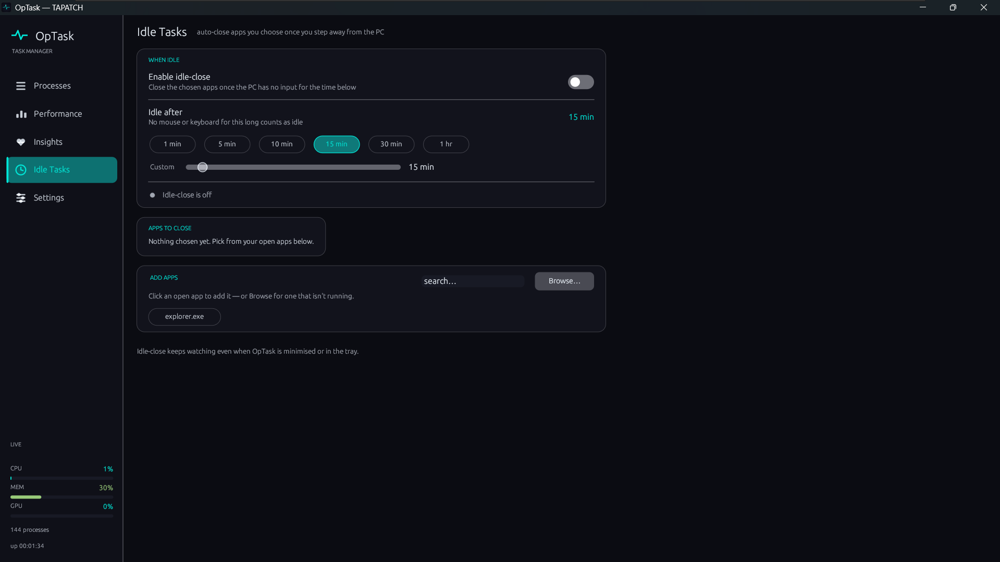<br>
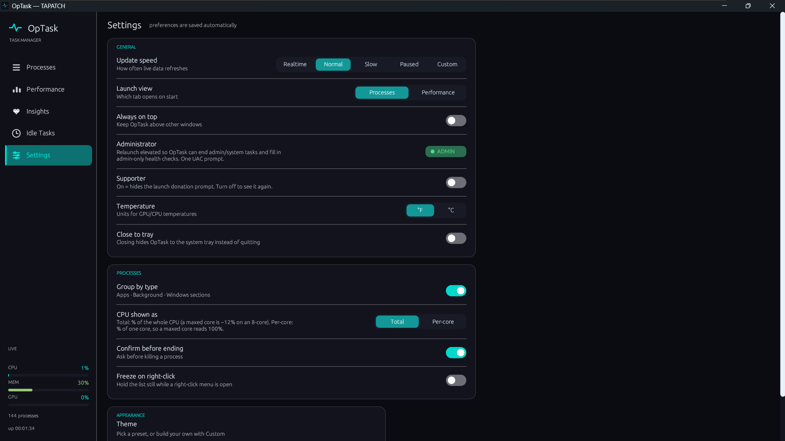 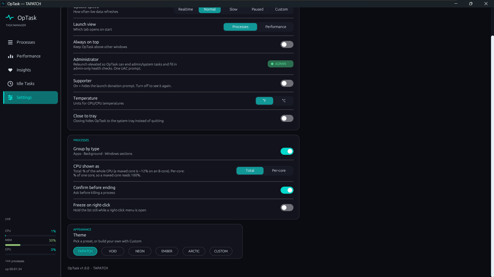<br>
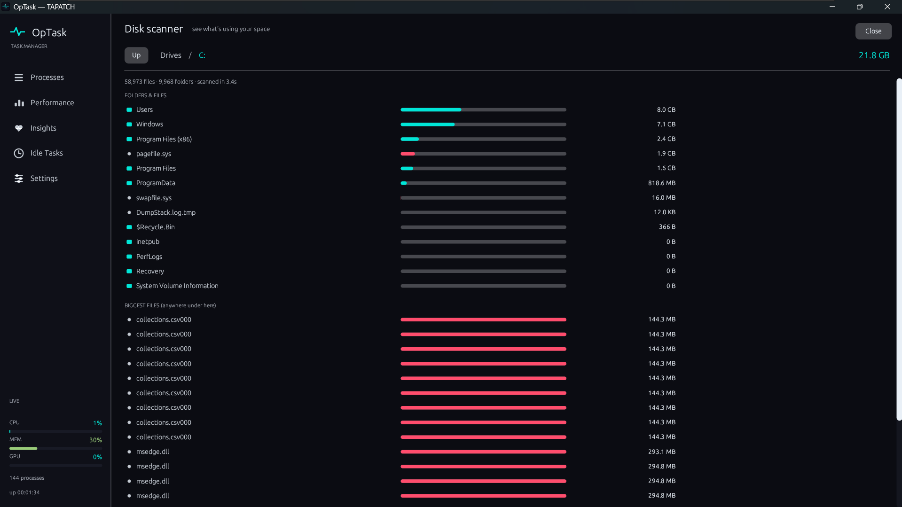 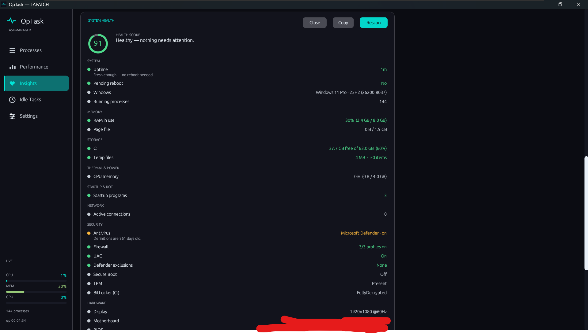<br>
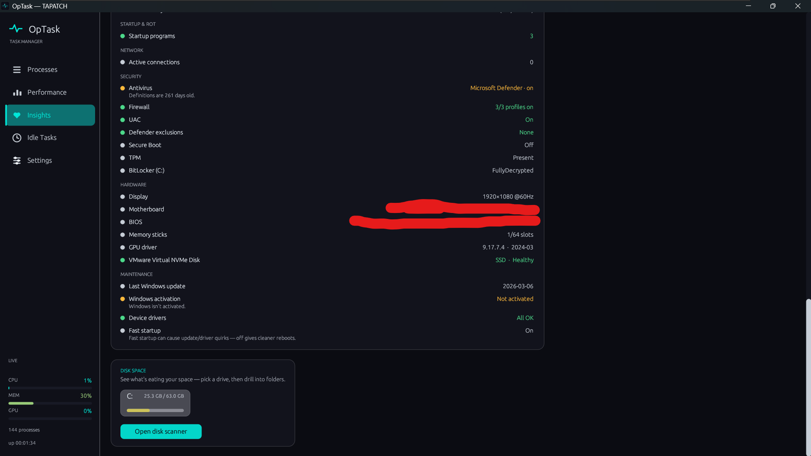
</p>

> Built because the stock Task Manager shows you a spike and nothing else. A process quietly sitting at 1% all day costs more total CPU-time, heat, and battery than a rare burst — OpTask is built to surface exactly that.

## What it does

OpTask is a modern Windows task manager and system monitor. A virtualised process list groups apps the way Task Manager does, with slim live meters, one-click end-task, priority control, and a shield on anything that needs admin to kill. Performance graphs cover CPU, every logical core, memory, GPU (any vendor), disk, and network. Insights ranks your real long-term resource hogs by integrated CPU-time, peak memory, and disk I/O — not headline percentages — and a roughly 30-check System Health scan reads uptime, storage, thermals, security (Defender, firewall, UAC, Secure Boot, TPM, BitLocker), drivers, and more. A full-screen Disk Scanner finds what's eating your space, and Idle Tasks auto-closes apps you choose once you step away. Five themes plus a custom editor. Zero network, zero telemetry — everything runs locally.

[](https://www.youtube.com/watch?v=oX-WQSwtvMU)

## Features

A full system monitor in one tight binary. Here are the highlights.

**🧮 Smart process list**  
Virtualised, grouped Apps / Background / Windows view with live gradient meters, search, end-task, process-tree kill, and priority control. A shield marks every process that needs admin to end.

**📈 Performance graphs**  
Painted live graphs for CPU, every logical core, memory, GPU (NVIDIA / AMD / Intel), disk throughput, and network up/down — sourced from the same counters Task Manager uses.

**💡 Insights**  
Ranks your real long-term resource hogs by integrated CPU-time, peak memory, and disk I/O — the honest 'what actually costs me' number, not a momentary spike. Expand any ranking to the full list.

**🩺 System Health scan**  
Around 30 checks across system, memory, storage, thermals & power, network, security (Defender, firewall, UAC, Secure Boot, TPM, BitLocker), hardware, and maintenance — scored and colour-coded.

**🗂️ Disk Scanner**  
Full-screen WinDirStat-style scan: pick a drive, drill into folders with size bars, find the biggest files, and right-click to open in Explorer or send to the Recycle Bin. Runs at background I/O priority.

**🕐 Idle Tasks**  
Pick apps to auto-close once the PC sits idle for a time you set. Keeps watching even minimised or in the tray — handy for closing games or browsers when you walk away.

**🎨 Themes + tray**  
TAPATCH, VOID, NEON, EMBER, ARCTIC presets plus a full custom colour editor. Close-to-tray, always-on-top, °F/°C, and per-core or whole-machine CPU all toggle in Settings.

## Limitations

- Windows 10/11 only. GPU temperature requires an NVIDIA card (via NVML); utilisation and VRAM work on every vendor. Viewing Defender exclusions and ending elevated processes require running OpTask as administrator.

## What's new in 1.0.2

- Now in 10 languages: English, Chinese (Simplified), Russian, Spanish, Portuguese, German, Japanese, French, Polish and Korean
- Starts in your Windows language (English if yours isn't one of the 10). The first launch asks which language you want, and you can switch any time inside the app
- The installer comes in the same 10 languages
- The Terms of Service are shown translated for convenience, with the official English (US) text, the only binding version, right below

Release notes for every version are on the [Releases](https://github.com/tapatchUSA/OpTask/releases) page.

## Install

1. Download **OpTask-Setup-1.0.2.exe** from the [latest release](https://github.com/tapatchUSA/OpTask/releases/latest) or from [tapatch.com](https://tapatch.com/tools/optask/).
2. Run it. The installer and the app come in 10 languages.
3. Accept the Terms of Service on first launch.

Windows may show a SmartScreen warning for new downloads. Click **More info → Run anyway**.

Or with [Scoop](https://scoop.sh):

```powershell
scoop bucket add tapatch https://github.com/tapatchUSA/packages
scoop install tapatch/optask
```

## All versions

| Version | Released | Installer | VirusTotal | SHA-256 |
|---|---|---|---|---|
| [1.0.2](https://github.com/tapatchUSA/OpTask/releases/tag/v1.0.2) | 2026-10-01 | [OpTask-Setup-1.0.2.exe](https://github.com/tapatchUSA/OpTask/releases/download/v1.0.2/OpTask-Setup-1.0.2.exe) | [2 / 70](https://www.virustotal.com/gui/file/6fe4d5f37e753263c247d1f89b518de22fef67c5732fd17ac57971d6707e8665/detection) | `6fe4d5f37e753263…` |
| [1.0.1](https://github.com/tapatchUSA/OpTask/releases/tag/v1.0.1) | 2026-09-30 | [OpTask-Setup-1.0.1.exe](https://github.com/tapatchUSA/OpTask/releases/download/v1.0.1/OpTask-Setup-1.0.1.exe) | [1 / 71](https://www.virustotal.com/gui/file/3f2e22dce9cb90de7c24905fe61026a78e1a7b22e5d3268bb3d81a19cff50b6a/detection) | `3f2e22dce9cb90de…` |
| [1.0.0](https://github.com/tapatchUSA/OpTask/releases/tag/v1.0.0) | 2026-09-16 | [OpTask-Setup-1.0.0.exe](https://github.com/tapatchUSA/OpTask/releases/download/v1.0.0/OpTask-Setup-1.0.0.exe) | [3 / 70](https://www.virustotal.com/gui/file/0eee816757756e884bfc6d2653a948a8cfc2cf44cc569be60bd65138624cc226/detection) | `0eee816757756e88…` |

## Security

Every installer is scanned on VirusTotal before release. OpTask 1.0.2: **2 / 70** engines flag it · [view report](https://www.virustotal.com/gui/file/6fe4d5f37e753263c247d1f89b518de22fef67c5732fd17ac57971d6707e8665/detection)

**SHA-256**
```
6fe4d5f37e753263c247d1f89b518de22fef67c5732fd17ac57971d6707e8665
```

## Built with

Rust · egui · eframe · windows · sysinfo

## License

Free for personal use. Business or commercial use requires a paid license (see [tapatch.com/terms](https://tapatch.com/terms/)). Full terms: [tapatch.com/terms/software](https://tapatch.com/terms/software/).

This repository holds the official installers and release notes.

---

**[tapatch.com](https://tapatch.com)**: small tools, serious quality. Built solo, shipped with care.
